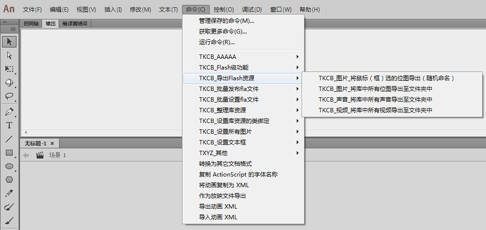

# Animate & Flash JSFL 命令集，随时更新....
这是我们TKCB乐队开发的JSFL命令集（70多个，但其实git上面暂时为旧版，新版早已100+个）。

JSFL是Flash（Animate）软件，内部的操作命令代码，可帮助动画师和开发者的更好的使用Flash软件。

### JSFL其实是被大家忽略的重要功能
在Flash的菜单栏中，有一个命令菜单，其实这就是JSFL，她很简单，就是你选下菜单的子项目点击就可以了。

她可以神奇的实现一些看似复杂的功能，比如重命名所有库元件，导出所有库的图片声音视频等等。

### 一些废话
由于前一短时间学习了Java Script，故对于JS有了一定的了解（其实AS3和JS有很多类似的地方）。

最近对Flash JSFL有一点点兴趣，于是学习之，随着学习的深入渐渐的感觉JSFL相当腻害！

于是乎，我写了一些自己认为会在Flash制作中用到的JSFL命令，于是便想着分享给大家使用，以便更多人受益（这也一直是我追求的）。

编写JSFL版本为Flash CS6和Flash CC2014-2017，AS版本为3.0，PC平台为window，故在此基础上运行JSFL基本不会出现问题。

如果在高版本低版本，报错或者异常，可以查看源JSFL代码，进行修改或者删除，部分JSFL命令或许不适合低版本或者高版本。

### 将JSFL导入到Flash命令菜单中（寻找JSFL命令存放地址）
把“TKCB_寻找JSFL命令存放地址.jsfl”文件，用鼠标拖拽到Flash （Animate）软件中会在输出面板中显示JSFL命令的存放路径地址，然后将所有的TKCB命令文件夹复制到其中就可以了。

点这里查看视频教程：http://www.11ria.com/forum.php?mod=viewthread&tid=1876

废话不想太多，下面是所有JSFL命令的名称和简要说明：

### Flash级功能
// FlashCC才可以使用这个功能，导出的视频只能是mov格式

 **TKCB_将当前文档导出为mov视频（Flash CC）.jsfl** 

// 哈哈，又是一个用处不大的功能，练手的

 **TKCB_将当前文档导出为swf.jsfl** 

// 很久之前我以为Flash CC不再提供发布为放映文件（.exe和.app），但是没想到CC版本提供了这个功能的JSFL命令

// 于是我无耻的将这个命令作为加入到TKCB命令系列，以方便大家使用

// projectorUI.xul这个文件是这个命令会用的的UI文件，请务必复制粘贴

 **TKCB_将当前文档导出为放映文件（Flash CC）.jsfl** 

// 为了更加方便准确的找到JSFL命令的存放地址，于是写了这条命令（或许也是多此一举把）

 **TKCB_寻找JSFL命令存放地址.jsfl** 

### 导出Flash资源
// 资源（图片、声音、视频等）会导出至与Flash文档同名+（声音）的名称的文件夹中，父文件夹为自己选择的文件夹

 **TKCB_声音_将库中所有声音导出至文件夹中.jsfl** 

 **TKCB_视频_将库中所有视频导出至文件夹中.jsfl** 

 **TKCB_图片_将库中所有位图导出至文件夹中.jsfl** 

// 鼠标在Flash舞台中选中多少个位图，就导出多少个为到自己选择的文件夹中（随机命名），并且以原始的类型保存（JPG或者PNG）

 **TKCB_图片_将鼠标（框）选的位图导出（随机命名）.jsfl** 

### 批量发布fla文件
// 对于好多人来说这个功能或许是唯一的有用的功能吧！！！（至少某大神是这样说的）

// 使用默认的发布设置批量发布，如果默认的发布设置有swf和html或更多，则会发布对应的文件

 **TKCB_批量发布fla文件（默认发布设置）.jsfl** 

// 有些时候，只需要发布SWF文件，则可以使用下面的命令

 **TKCB_批量发布fla文件（只发布SWF文件）.jsfl** 

// 有些时候，只需要发布SWF和HTML文件，则可以使用下面的命令

 **TKCB_批量发布fla文件（只发布SWF和HTML文件）.jsfl** 

// 有些时候，只需要发布SWC文件，则可以使用下面的命令

 **TKCB_批量发布fla文件（只发布SWC文件）.jsfl** 

### 批量设置fla文件
// 与“设置库资源的类绑定”里面的功能是一样的，只是这个是批量设置多个fla文件的库资源的类绑定

 **TKCB_批量设置库资源的类绑定（清除所有的类绑定）.jsfl** 

 **TKCB_批量设置库资源的类绑定（设置所有图片的类绑定 名称要唯一）.jsfl** 

 **TKCB_批量设置库资源的类绑定（设置所有影片剪辑的类绑定 Sprite类）.jsfl** 

// 与“设置所有图片”里面的功能是一样的，只是这个是批量设置多个fla文件的所有图片为无损和平滑属性

 **TKCB_批量设置图片属性（无损）.jsfl** 

 **TKCB_批量设置图片属性（无损和平滑false）.jsfl** 

 **TKCB_批量设置图片属性（无损和平滑true）.jsfl** 

// 与“整理库资源”里面的功能是一样的，只是这个是批量整理多个fla文件的库资源

 **TKCB_批量整理库资源（以随机方式 重命名所有资源 乱）.jsfl** 

 **TKCB_批量整理库资源（以序列方式 分类命名整理至文件夹 英文）.jsfl** 

 **TKCB_批量整理库资源（以序列方式 分类命名整理至文件夹 中文）.jsfl** 

### 批量操作元素
// 看名字很好理解，就是将鼠标框选的元素（通常为一个按钮），进行批量的复制粘贴操作

// 按照传入的数量和间隔进行命令操作，参数之间以空格作为间隔符号，空格鼠标可以随便输入

 **TKCB_按照指定间隔批量复制鼠标选择的元素（横向）.jsfl** 

 **TKCB_按照指定间隔批量复制鼠标选择的元素（横向+竖向）.jsfl** 

 **TKCB_按照指定间隔批量复制鼠标选择的元素（竖向）.jsfl** 

// 基本和批量复制元素是顺序进行的，因为有时候批量复制很多元件，但又不想一个个进行命名

// 于是就是用这套JSFL命令，进行快速的复制和命名了

 **TKCB_自定义名称批量对元件设置实例名称（从0开始）.jsfl** 

 **TKCB_自定义名称批量对元件设置实例名称（从1开始）.jsfl** 

### 设置库资源的类绑定
// 使用这个命令进行快捷的类绑定要注意几个事情

// 1.这个JSFL命令会忽略设置那些已经绑定了类的图片或声音

// 2.图片名称务必保证是可以命名为类名称的“英文+数字+下划线”组合，如果不能保证，可以使用“整理库资源”中的JSFL进行批量重命名

// 3.使用JSFL绑定类之后，只有点击一下库面板，图片或声音的链接名称才会显示出来

// 4.使用JSFL绑定类之后，在库面板中的AS链接栏中双击删除类名称，结果类名称仍在显示（显示残留），但是实际点开属性其实已经删除了（自己手动在属性里面设置可以删除显示残留）

 **TKCB_设置所有图片的类绑定（名称要唯一）.jsfl** 

 **TKCB_设置所有声音的类绑定（名称要唯一）.jsfl** 

// 和图片的类绑定差不多，只不过这个是对影片剪辑的自定义的类绑定（有prompt对话框），名称也要是唯一的

 **TKCB_设置所有影片剪辑的类绑定（自定义类）.jsfl** 

// 黑羽大侠曾经说过，如果将没有用到时间轴和帧代码的影片剪辑设置为Sprite类型，则可以提高效率，故实现之

// JSFL代码自动识别，会忽略所有帧代码或有时间轴（>1）影片剪辑

 **TKCB_设置所有影片剪辑的类绑定（Sprite类）.jsfl** 

// 第一个是清除所有的类绑定，下面三个分别清除对应的类绑定

 **TKCB_清除所有的类绑定.jsfl** 

 **TKCB_清除所有声音的类绑定.jsfl** 

 **TKCB_清除所有图片的类绑定.jsfl** 

 **TKCB_清除所有影片剪辑的类绑定.jsfl** 

### 设置所有图片
// 常常我们需要将图片设置为最清晰的设置，也就是无损和平滑处理，所以可以使用下面的命令

 **TKCB_设置所有图片格式为无损+平滑.jsfl** 

// 常常我们需要将库中的图片设置为指定的压缩格式，可以使用下面的命令

// JPG会改变所有图片的压缩格式，而无损只会将带通道的PNG图片设置为无损（因为JGP没必要设置为无损）

 **TKCB_设置所有图片格式为JPG.jsfl** 

 **TKCB_设置所有图片格式为无损.jsfl** 

// 常常我们需要设置库中图片的自定义品质，以追求更好的显示效果或者更好的压缩大小，可以使用下面的命令

 **TKCB_设置所有图片品质为1-100（默认80）.jsfl** 

// 设置库中所有图片的平滑选项，下面命令可以让你一键搞定

 **TKCB_设置所有图片平滑（true）.jsfl** 

 **TKCB_设置所有图片平滑（false）.jsfl** 

// 设置库中所有图片的消除马赛克选项，下面命令可以让你一键搞定

 **TKCB_设置所有图片消除马赛克（true）.jsfl** 

 **TKCB_设置所有图片消除马赛克（false）.jsfl** 

### 整理库资源
// 常常很多人很多人都不注意元件的命名和整理，于是乎，就让程序来做这个工作吧

// 以“TKCB_”为前缀，以0-10的数字为后缀序列重命名所有资源

 **TKCB_以序列方式重命名所有资源.jsfl** 

// 在弹出的prompt（提示）对话款中输入前缀名称，注意不要是不可命名的字符，之后程序会自动以0-10的数字为后缀序列重命名所有资源

 **TKCB_以序列方式重命名所有资源（允许自定义前缀）.jsfl** 

// 这个也是有prompt（提示）对话框，自定义命名前缀

// 但这个命令的强大之处在于将资源文件按照类型（图片、声音、视频、元件、字体、组件六种）自动放置在相应的文件夹

// 这两个的不同之处在于一个是创建的中文文件夹，另一个是英文

 **TKCB_以序列方式重命名所有资源（并整理至文件夹 中文）.jsfl** 

 **TKCB_以序列方式重命名所有资源（并整理至文件夹 英文）.jsfl** 

// 与上面两个差不多，这个中文指的是文件夹名，资源的名称都是英文的，这个不能自定义命名前缀（但更简单！）

// 之所以会有这样一个JSFL，是因为我在实际工作中遇到很多Flash制作人员都不熟悉英文并且没有良好的命名

 **TKCB_以序列方式重命名所有资源（并分类命名整理至文件夹 中文）.jsfl** 

 **TKCB_以序列方式重命名所有资源（并分类命名整理至文件夹 英文）.jsfl** 

// 有时候我们希望所有库的资源都是英文的，下面命令将随机命名（英文+数字英文下划线）

 **TKCB_以随机方式重命名所有资源（乱）.jsfl** 

// 以每一个单独的资源类型批量重命名，允许自定义前缀，有：字体、影片剪辑、图形元件、按钮、图片、声音、视频

 **TKCB_以序列方式重命名所有（字体）.jsfl** 

 **TKCB_以序列方式重命名所有（影片剪辑）.jsfl** 

 **TKCB_以序列方式重命名所有（图形元件）.jsfl** 

 **TKCB_以序列方式重命名所有（按钮）.jsfl** 

 **TKCB_以序列方式重命名所有（图片）.jsfl** 

 **TKCB_以序列方式重命名所有（声音）.jsfl** 

 **TKCB_以序列方式重命名所有（视频）.jsfl** 

### 设置文本框
// Flash默认的三种文本（静态、动态、输入）是不支持“中文”的两端对齐的

 // 所以使用字符之间加空格的方式可以基本实现两端对齐，但会强制将静态文本转换为动态文本

 // BUG说明：对于纯粹的中文支持的比较好，如果是中英混合则有一些小问题，右边的英文字母可能会有部分显示不出来

 **TKCB_文本_将鼠标（框）选的文本两端对齐.jsfl** 

### 其他（收集的各路大神写的JSFL命令）
// 这个是“General_Clarke”大神写的命令，盗用之（我一向如此）

// 用法很简单，就是把当前的时间轴动画转成位图序列

// 注意1：未命名的Flash文件会报错，所以测试的话要保存fla

// 注意2：限制Flash CS6使用，其他版本可能不行，会报错

 **General_Clarke_当前时间轴动画转位图序列.jsfl** 

// 这个是“General_Clarke”大神写的命令，盗用之（我一向如此）

// 项目开发过程中，如果不注意，会为某些文本框设置了动画消除锯齿，或者特殊字体

// 这些字体可能未嵌入，这将导致最终用户的文本框中显示出系统默认字体，或者干脆不能显示文字

// 很多时候出现，拿到一个fla后（尤其是开源第三方fla），弹出提示找不到字体，询问是否使用设备字体

// 使用设备字体会有损效果、造成文字出格等问题。

// 但程序员根本不知道哪里的文本框被换用了设备字体。

// 此jsfl工具能寻找出fla文件中使用特殊字体或特殊渲染方式的全部文本框

// 最终将分析结果显示在输出面板中（fl.trace）

 **General_Clarke_找出未使用设备字体的文本框.jsfl** 

// 我也不知道这个是不是“流连水”的作者写的，只是看到是一个名叫这个的网友上传的

// 说明和用法很简单，就是删除所有帧代码

 **流连水_清除所有帧代码.jsfl** 

// 这个是“闪刀浪子”大神写的命令，盗用之（我一向如此）

// 下面是这个有什么需求的情况下使用这个JSFL命令：

// 我们需要把每一位图都变成一个MC,同时把这个MC作为一个导出类来用

// 每一个位图都有一个唯一的导出类名

// 所有的位图变成MC之后都是左上角作为原点

// 处理完的位图和MC都在库里面分目录存放，资源的种类作为目录

// 位图的文件名中记录了种类、名称和导出类名。

// 该命令中图片命名强制规则：【种类_名称_导出类名】，否则命令会报错

 **闪刀浪子_图片包装成MC后设置类绑定并分类（图片名称有强制规则）.jsfl** 

// 我也不知道这个是不是“紫梦”的作者写的，只是看到是一个名叫这个的网友上传的

// 这个是一个自动化的代码，就是选择一个序列图片的文件夹

// 然后就可以把这个文件夹中所有图片打包成swf发布出来

 **紫梦_序列图自动生成Flash并发布SWF文件.jsfl** 

### 再来一些废话
由于我也在学习，故不保证我写的都是正确的，希望能有高手不吝赐教。

还有还有我会不断更新我写的JSFL命令集的，所以偶尔可以点个赞，再来看看，或许有惊喜。

大家想实现某些功能，可以告诉我（tkcb@qq.com）），我如果觉得能实现会写出来，然后上传到这里。

而且我的代码都是有注释和清晰的格式，大家也可以自己修改以满足更多的自定义的功能。

### 最后的祝福
祝愿大家学习愉快，工作开心、生活如意，遇到挫折苦难逆境也要勇敢向前走……

真诚的希望我们的软件和游戏，帮助到了大家，也感谢您的使用……

但愿我们都可以做一个改变世界的人，也不要被世界改变。

### 许可证
[MIT](https://github.com/TKCB/TKCB-JSFL-Command-Set/blob/main/LICENSE)
